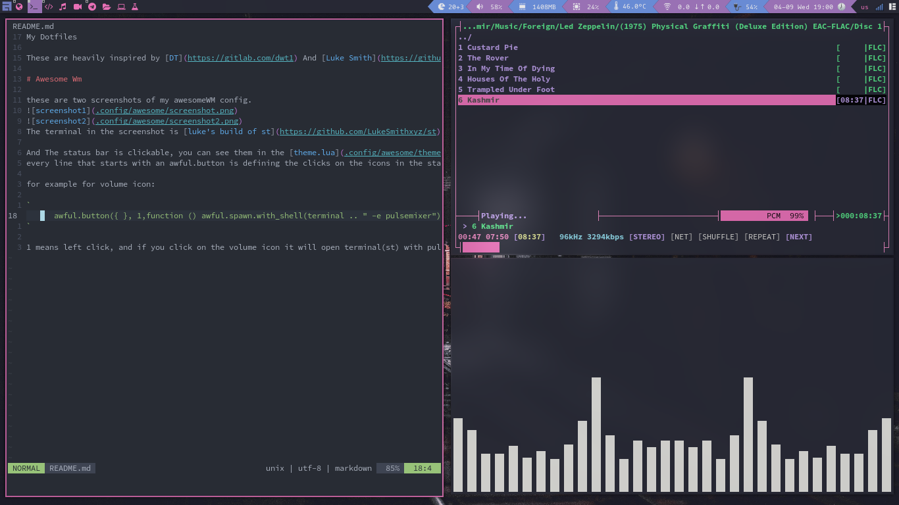

My Dotfiles

These are heavily inspired by [DT](https://gitlab.com/dwt1) And [Luke Smith](https://github.com/lukesmithxyz)
also other references: [lain](https://github.com/lcpz/lain) , [awesome-freedesktop](https://github.com/lcpz/awesome-freedesktop) and [awesome-copycats](https://github.com/lcpz/awesome-copycats)

# Awesome Wm

these are two screenshots of my awesomeWM config.

The terminal in the screenshots is [luke's build of st](https://github.com/LukeSmithxyz/st)
with minor changes to config.h

And The status bar is clickable, you can see them in the [theme.lua](.config/awesome/themes/powerarrow-blue/theme.lua) for powerarrow-blue theme.
every line that starts with an awful.button is defining the clicks on the icons in the status bar.

for example for volume icon:

`
      awful.button({ }, 1,function () awful.spawn.with_shell(terminal .. " -e pulsemixer") end),
`

1 means left click, and if you click on the volume icon it will open terminal(st) with pulsemixer.
